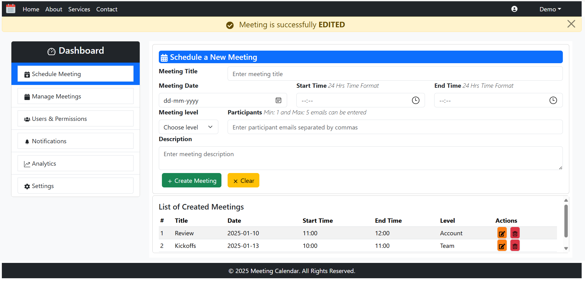

## MEETING CALENDAR APPLICATION Using REACT JS
### Objective:
Create a Meeting Calendar Component with all the necessary functionalities in the Schedule Meeting component. This includes form validation, managing user data. Follow React best practices to ensure the solution is modular, reusable, scalable, and professional.

Design a Meeting Calendar Application with ReactJS according to the provided template: [MeetingCalendar](doc/MeetingCalendar.pdf)

### Installed Plugins:
* **`Bootstrap:`** Integrated Bootstrap framework with React for creating responsive and visually appealing react web application.
* **`Validator:`** This plugin used for validating date and time.
* **`React Icons:`** This plugin allows to include only the icons that the project is using.
* **`React Hook form:`** It is a library that simplifies form handling in React with easy field registration, validation, error handling and provides fast performance.

### Meeting Calendar User Interface:
* Meeting Calendar React Component is a frontend react application more focusses on schedule and manage meetings.
* It implements all the necessary CRUD functionalities inside Schedule Meeting component. Other components/tabs visible in UI are just a component with no functionality implemented.

### Storage Area:
* Service layer is present inside "src" folder which has a javascript file, MeetingAPI.js. This file has the storage area, "meetingData" which is an **array of meeting objects**. Whenever the meeting is created, updated or deleted, then it is reflected inside this storage area.
* It has components like getAllMeetingsData, addMeetingData, updateMeetingData and deleteMeetingData to perform CRUD operations.
* So, this frontend application **simulate the behaviour of backend application** through a storage area which is present inside Service layer. 

### Components of User Interface:
1. **Navbar** -> Contains navigations tabs like Home, About, Services and Contact. At the right end, Place for Icon and Demo tab is provided.
2. **MainContent** -> 
    * Considered this as a parent component and it has 4 child components.
    * All the state variables, components(methods) to perform any of the CRUD operation and useEffect() methods are declared inside this main component.
    * Whenever any of the child component is rendered, then the state information and operational methods needed for that child component to deliver are sent as **`props`**.
    * **`useEffect():`** Whenever the page is rendered for the very first time or modified, then the getAllMeetingsData component in service layer is called to render the updated version of storage area.
    * **`Child components:`**
        - **Dashboard** -> Contains components/tabs like Schedule Meeting, Manage Meetings, Users & Permissions, Notifications, Analytics and Settings. This component helps to switching between the components. Tabs gets selected during switching.
        - **Alert popup** -> Displays alert message only after performing operations like Create, Update, Delete.
        - **Form** -> React Hook form is used behind this form development. It helps to register field, event handling, validate field and throw error when a field does not have value. 
            - **`Form Validation:`**
                i. Form can be submitted only when all the fields are present. Otherwise, this form will throw field wise error.
                ii. Participants - 1 to 5 participants can be entered.
                iii. Past dates are disabled.
                iv. Start time and End time should be in future. End time should be after Start time.
            - **`Form operations:`**
                i. CREATE meeting: After entering all fields in the form, then user can click "Create" button to create the meeting.
                ii. UPDATE meeting: After doing the necessary modification, then user can click "Update" button to edit the meeting.
                iii. CLEAR: If user don't want the entered values and want to reset the field values, then user can click "Clear" button to reset the form fields.
        - **Render meetings** -> Display the list of created meetings. In each meeting record, icons for edit and delete is provided.
            - On Clicking edit icon, all the fields for that record is set inside form and user can modify it. If user clicks "Update", then reflect the changes in storage area. If user clicks "Clear", then changes are not reflected in storage area.
            - On Clicking delete icon, "Confirm to delete?" popup is shown. If user clicks yes, the meeting is deleted. If user clicks cancel, the meeting is not deleted.
3. **Footer** -> "All Rights Reserved" is included.

### Enhancement:
This Frontend Application can be enhanced to Full Stack Web Application with the following features:
* Switch across multiple components in Navigation bar and Dashboard using Routers.
* Develop a backend Java application which connects with MySQL database for doing CRUD operations.
* Connect with backend application using Axios for sending request to them and receiving response from them.

        Enhanced this project into Full Stack Web Application with React in the Frontend and Java at the Backend.
        The project is available in the repository link:
        https://github.com/Saru-Jayaraman/MeetingCalendar_FullStack

### Sample UI:
